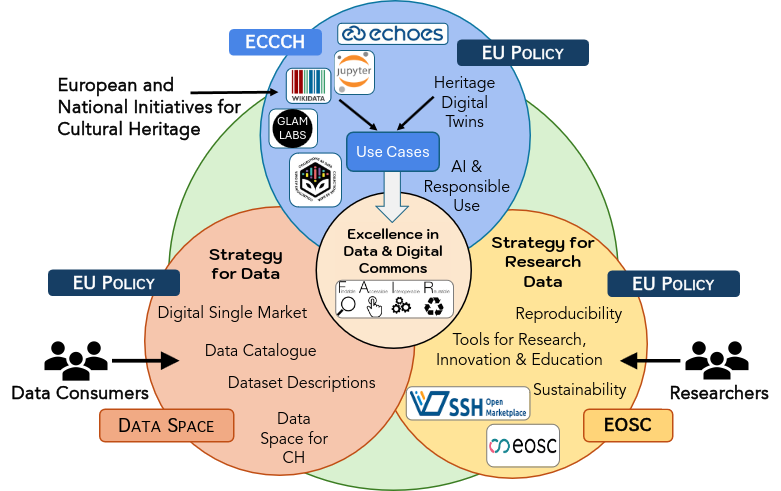
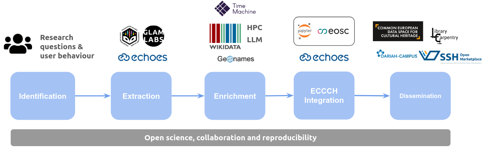
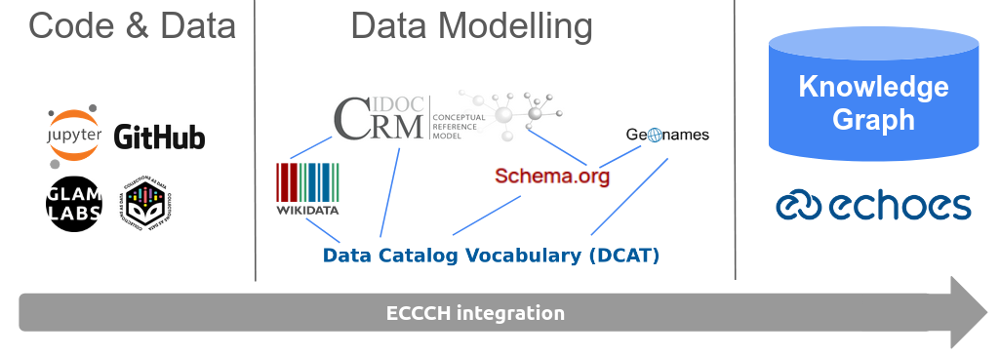

# A Use Case Lens on Digital Cultural Heritage

This project shows a selection of use cases based on the [European Collaborative Cloud for Cultural Heritage](https://www.echoes-eccch.eu) (ECCCH). It provides a collection of Jupyter Notebooks describing how the use cases are created including details about the data reused, the extraction, process and integration with EU research data infrastructures.

## Use cases

The following picture shows how existing platforms and services are integrated to create the use cases in the ECCCH, to foster excellence in data and Digital Commons. Note that this figure was inspired by the ECHOES project website and tries to illustrate how our approach fits within the current research data infrastructure.

Note that the code provided in thiw work is in the form of a prototype. In some cases, a local environment is required such as the case of the employment of local LLMs for OCR and storing word embeddings. This work intends to provide an approach of how it could be implemented, since the ECCCH is currently under development. The collection of notebooks can be run in a local environment as well as using cloud services such as [Binder](https://mybinder.org/) and [EOSC Interactive Notebooks](https://open-science-cloud.ec.europa.eu/services/interactive-notebooks).

All the use cases employs the following workflow:

For the integration with the ECCCH, and its knowledge base, we have used several ontologies such as [CIDOC-CRM](https://cidoc-crm.org/), [Schema.org](https://schema.org/) and [Data Catalog Vocabulary (DCAT)](https://www.w3.org/TR/vocab-dcat-3/). In particular, the [CIDOCdig](https://cidoc-crm.org/crmdig) model for provenance metadata is interesting to describe the outputs of this work. Note that in this approach, and given that the ECCCH data model is still under development, we describe as main classes software (Jupyter Notebooks) and data. 

### Using and reusing notebooks in high-performance computing environments 

This use case shows how to reuse a [collections of maps made available by the National Library of Spain](https://bnedigital.bne.es/bd/es/export?o=&o=o&o=n&o=&o=o&o=n&w=&w=&w=&w=&w=&w=&f=ficha&f=ficha&f=ficha&f=ficha&f=ficha&f=ficha&p=&f4=Material+cartogr%C3%A1fico+manuscrito&g=ws&g=dd&g=ld&g=pd&g=pg&g=hh&g=fa&d=date&d=&d=&startYear=&endYear=&year=&l=10&x=adefadbf-b10b-4a34-a0d7-98513056a7b3) following a set of steps in the form of a reproducible workflow: extraction, OCR analysis using LLMs, metadata generation and dissemination in platforms such as Zenodo. For more information, see the [notebook](HPC.ipynb).

### Application of notebooks in digital twins

### AI preservation use case

### Open Science for notebooks

This use case will address Open Science for data and code sharing using platforms such as Zenodo and OpenAIRE and making the entire research process more transparent and accessible, promoting collaboration, and maximizing the impact of research. It will try to answer the follwing research questions: (1) How can Open Science and Digital Commons be addressed by means of notebooks in the ECCCH? (2) How can we showcase, extend and improve the ECCCH to fully support Open Science and Digital Commons in order to engage with the public? For more information, see the [notebook](Open-Science.ipynb).

### Sustainability for notebooks
This use case will showcase how existing notebooks projects provided by relevant European institutions can be assessed in terms of sustainability. It will use the collection of Jupyter Notebooks compiled by the [International GLAM Labs Community](https://www.glamlabs.io/computational-access-to-digital-collections). For more information, see the [notebook](Sustainability.ipynb).

## Licence
 Content is licensed under a <a rel="license" href="http://creativecommons.org/licenses/by/4.0/">Creative Commons Attribution 4.0 International license</a>.

Please, note that the datasets used in this project have separate licences.

## Installation guide

The code can be run on cloud services such as Binder without the need to install additional software and using only the web browser by clicking on the link provided at the beginning of this documentation.

The code can be also installed in a computer by following these steps:

- download the code from GitHub
- open the folder with the code
- run the command: pip install -r requirements.txt
- open Jupyter (or Anaconda)
- open the notebooks provided

Note that these notebooks can be run in different cloud services such as [Binder](https://mybinder.org/) and [EOSC Interactive Notebooks](https://open-science-cloud.ec.europa.eu/services/interactive-notebooks).

## How to cite
- Gustavo Candela, Milena Dobreva, Henk Alkemade, Olga Holownia, Mahendra Mahey, Sarah Ames, Karen Renaud, Ines Vodopivec, Benjamin Charles Germain Lee, Thomas Padilla, Steven Claeyssens, Isto Huvila, Beth Knazook, Sander Münster: A Use Case Lens on Digital Cultural Heritage. CoRR abs/2509.08710 (2025)
  
## References
- Niccolucci F, Markhoff B, Theodoridou M et al. The Heritage Digital Twin: a bicycle made for two. The integration of digital methodologies into cultural heritage research [version 1; peer review: 2 approved with reservations]. Open Res Europe 2023, 3:64 (https://doi.org/10.12688/openreseurope.15496.1)
- Gustavo Candela, Milena Dobreva, Henk Alkemade, Olga Holownia, Mahendra Mahey, Sarah Ames, Karen Renaud, Ines Vodopivec, Benjamin Charles Germain Lee, Thomas Padilla, Steven Claeyssens, Isto Huvila, Beth Knazook: A Use Case Lens on Digital Cultural Heritage. CoRR abs/2509.08710 (2025)
- https://open-science-cloud.ec.europa.eu/services/interactive-notebooks
- Gustavo Candela, Javier Pereda, Dolores Sáez, Pilar Escobar, Alexander Sánchez, Andrés Villa Torres, Albert A. Palacios, Kelly McDonough, and Patricia Murrieta-Flores. 2023. An Ontological Approach for Unlocking the Colonial Archive. J. Comput. Cult. Herit. 16, 4, Article 74 (December 2023), 18 pages. https://doi.org/10.1145/3594727
- Sander Münster, Melissa Terras, The visual side of digital humanities: a survey on topics, researchers, and epistemic cultures, Digital Scholarship in the Humanities, Volume 35, Issue 2, June 2020, Pages 366–389, https://doi.org/10.1093/llc/fqz022
- Candela, G., Rosiński, C., & Margraf, A. (2025). A reproducible framework to publish and reuse Collections as data: the case of the European Literary Bibliography (Version 4, Vol. 965, Issue 170). Transformations: A DARIAH Journal . https://doi.org/10.46298/transformations.14729
- Gustavo Candela, Javier Pereda, Dolores Sáez, Pilar Escobar, Alexander Sánchez, Andrés Villa Torres, Albert A. Palacios, Kelly McDonough, and Patricia Murrieta-Flores. 2023. An Ontological Approach for Unlocking the Colonial Archive. J. Comput. Cult. Herit. 16, 4, Article 74 (December 2023), 18 pages. https://doi.org/10.1145/3594727
- https://developers.zenodo.org/#quickstart-upload
- https://www.echoes-eccch.eu/wp-content/uploads/2025/06/ECHOES_HDT_Ontology.pdf
- https://marketplace.sshopencloud.eu/about/api-documentation
- https://www.wikidata.org/
- https://cidoc-crm.org/crmdig
- https://cidoc-crm.org/sites/default/files/CRMdigv4.0.pdf
- https://cidoc-crm.org/html/cidoc_crm_v7.1.3.html
- Niccolucci, Franco, and Achille Felicetti. 2024. "Digital Twin Sensors in Cultural Heritage Ontology Applications" Sensors 24, no. 12: 3978. https://doi.org/10.3390/s24123978
- https://fusion-jena.github.io/fairjupyter/
- https://www.echoes-eccch.eu/faq/
